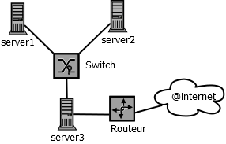

= Dossier d'Architecture Technique
Patrick Rioche
v1.0.0, 2018-06-19
:description: Ce document est un modèle de document d’architecture technique détaillé pour les développements d’applications Web en  AsciiDoc.
:keywords: AsciiDoc, Asciidoctor, syntax, reference

. Ce document est un modèle de document d’architecture technique détaillé pour les développements d’applications Web. Il s’adresse :
- Au chargé de projet.
- Aux architectes du projet
- A l’équipe de mise en production.

== HISTORIQUE DU DOCUMENTATION

|===
|Version|Date|Rédacteur|Description
|1|19/06/2018|Rioche Patrick|Dossier initial
|===

== VALIDATION

|===
|Représentants|Valideur|Date|Signature
|DSI|Rioche Patrick|19/06/2018|X
|===

== DIFFUSION

|===
|Pour validation |Pour action|Pour information
|Rioche Patrick|Rioche Patrick|Rioche Patrick
|===

== PREAMBULE

sdfsdf dfqfqq sqdqsd sdfsdf, sqdqds, qsdqd +
klklklm lmlkm lkmlk.

=== Lexique

sdfsdf dfqfqq sqdqsd sdfsdf, sqdqds, qsdqd +
klklklm lmlkm lkmlk.

=== Signalétique

sdfsdf dfqfqq sqdqsd sdfsdf, sqdqds, qsdqd +
klklklm lmlkm lkmlk.

== ARCHITECTURE TECHNIQUE GENERALE

sdfsdf dfqfqq sqdqsd sdfsdf, sqdqds, qsdqd +
klklklm lmlkm lkmlk.

=== Schéma global d’architecture

sdfsdf dfqfqq sqdqsd sdfsdf, sqdqds, qsdqd +
klklklm lmlkm lkmlk.

=== Plateforme technique

sdfsdf dfqfqq sqdqsd sdfsdf, sqdqds, qsdqd +
klklklm lmlkm lkmlk.

=== Flux

sdfsdf dfqfqq sqdqsd sdfsdf, sqdqds, qsdqd +
klklklm lmlkm lkmlk.

== BATCHS / INTERFACES

sdfsdf dfqfqq sqdqsd sdfsdf, sqdqds, qsdqd +
klklklm lmlkm lkmlk.

=== Traitement 1

sdfsdf dfqfqq sqdqsd sdfsdf, sqdqds, qsdqd +
klklklm lmlkm lkmlk.

==== Description

sdfsdf dfqfqq sqdqsd sdfsdf, sqdqds, qsdqd +
klklklm lmlkm lkmlk.

==== Fréquence et mode d’exécution

sdfsdf dfqfqq sqdqsd sdfsdf, sqdqds, qsdqd +
klklklm lmlkm lkmlk.

==== Description des entrées et des sorties

sdfsdf dfqfqq sqdqsd sdfsdf, sqdqds, qsdqd +
klklklm lmlkm lkmlk.

==== Description du processus de « logs » des traitements

sdfsdf dfqfqq sqdqsd sdfsdf, sqdqds, qsdqd +
klklklm lmlkm lkmlk.

==== Description du processus de gestion d’erreur

sdfsdf dfqfqq sqdqsd sdfsdf, sqdqds, qsdqd +
klklklm lmlkm lkmlk.

=== Traitement N

sdfsdf dfqfqq sqdqsd sdfsdf, sqdqds, qsdqd +
klklklm lmlkm lkmlk.

== DESCRIPTION DES DONNEES

sdfsdf dfqfqq sqdqsd sdfsdf, sqdqds, qsdqd +
klklklm lmlkm lkmlk.

=== Modèle conceptuel (Préciser la Version)

sdfsdf dfqfqq sqdqsd sdfsdf, sqdqds, qsdqd +
klklklm lmlkm lkmlk.

=== Modèle logique (Préciser la Version)

sdfsdf dfqfqq sqdqsd sdfsdf, sqdqds, qsdqd +
klklklm lmlkm lkmlk.

=== Modèle physique (Préciser la Version)

sdfsdf dfqfqq sqdqsd sdfsdf, sqdqds, qsdqd +
klklklm lmlkm lkmlk.

== DESCRIPTION DU CODE

sdfsdf dfqfqq sqdqsd sdfsdf, sqdqds, qsdqd +
klklklm lmlkm lkmlk.

=== Historique de la solution

sdfsdf dfqfqq sqdqsd sdfsdf, sqdqds, qsdqd +
klklklm lmlkm lkmlk.

=== Architecture du code (Préciser la Version)

sdfsdf dfqfqq sqdqsd sdfsdf, sqdqds, qsdqd +
klklklm lmlkm lkmlk.

=== Mécanismes d’identification et d’authentification

sdfsdf dfqfqq sqdqsd sdfsdf, sqdqds, qsdqd +
klklklm lmlkm lkmlk.

=== Mécanismes d’accreditation

sdfsdf dfqfqq sqdqsd sdfsdf, sqdqds, qsdqd +
klklklm lmlkm lkmlk.

=== Gestion des différentes langues

sdfsdf dfqfqq sqdqsd sdfsdf, sqdqds, qsdqd +
klklklm lmlkm lkmlk.

=== Description du processus de « logs » Applicatif

sdfsdf dfqfqq sqdqsd sdfsdf, sqdqds, qsdqd +
klklklm lmlkm lkmlk.

=== Description du processus de gestion  D’ERREUR

sdfsdf dfqfqq sqdqsd sdfsdf, sqdqds, qsdqd +
klklklm lmlkm lkmlk.

=== Gestion des accès concurrents

sdfsdf dfqfqq sqdqsd sdfsdf, sqdqds, qsdqd +
klklklm lmlkm lkmlk.

=== Sécurité

sdfsdf dfqfqq sqdqsd sdfsdf, sqdqds, qsdqd +
klklklm lmlkm lkmlk.

=== Autres éléments techniques

sdfsdf dfqfqq sqdqsd sdfsdf, sqdqds, qsdqd +
klklklm lmlkm lkmlk.

== PLATEFORMES MATERIELLES

sdfsdf dfqfqq sqdqsd sdfsdf, sqdqds, qsdqd +
klklklm lmlkm lkmlk.

=== Environnement préconisé

sdfsdf dfqfqq sqdqsd sdfsdf, sqdqds, qsdqd +
klklklm lmlkm lkmlk.

=== Spécificités relatives aux performances

sdfsdf dfqfqq sqdqsd sdfsdf, sqdqds, qsdqd +
klklklm lmlkm lkmlk.

== ANNEXES

=== Normes et Standards de Réalisation

sdfsdf dfqfqq sqdqsd sdfsdf, sqdqds, qsdqd +
klklklm lmlkm lkmlk.
