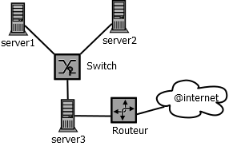

= Retour d'EXpérience
Patrick Rioche
v1.0.0, 2018-08-09
:description: Ce document est un modèle de document d’architecture technique détaillé pour les développements d’applications Web en  AsciiDoc.
:keywords: AsciiDoc, Asciidoctor, syntax, reference, REX

. Ce document est un modèle de document de retour d'expérience. Il s’adresse :
- Au chargé de projet.
- Aux architectes du projet
- A l’équipe de mise en production.

== Historique du document

|===
|Version|Date|Rédacteur|Description
|1|09/08/2018|Rioche Patrick|Dossier initial
|===

== Liste de diffusion

|===
|Destinataires
|Rioche Patrick, Rioche Patrick,....
|Rioche Patrick, ....
|===

== Préambule

sdfsdf dfqfqq sqdqsd sdfsdf, sqdqds, qsdqd +
klklklm lmlkm lkmlk.

=== Lexique

sdfsdf dfqfqq sqdqsd sdfsdf, sqdqds, qsdqd +
klklklm lmlkm lkmlk.

=== Signalétique

sdfsdf dfqfqq sqdqsd sdfsdf, sqdqds, qsdqd +
klklklm lmlkm lkmlk.

NOTE: Avertissement...

TIP: Astuce...

IMPORTANT: N'oublie pas...

WARNING: Attention à...

CAUTION: Veiller à ce que...

=== Bibliographie

|===
|Applications|Liens
|GitHub|https://github.com
|Dia|https://sourceforge.net/projects/dia-installer/
|Recherche|https://www.gooogle.com
|===

== Besoin exprimé par la maîtrise d'ouvrage (MOA)

sdfsdf dfqfqq sqdqsd sdfsdf, sqdqds, qsdqd +
klklklm lmlkm lkmlk.

=== Contexte

sdfsdf dfqfqq sqdqsd sdfsdf, sqdqds, qsdqd +
klklklm lmlkm lkmlk.

=== Les définitions

sdfsdf dfqfqq sqdqsd sdfsdf, sqdqds, qsdqd +
klklklm lmlkm lkmlk.

=== La solution révée

sdfsdf dfqfqq sqdqsd sdfsdf, sqdqds, qsdqd +
klklklm lmlkm lkmlk.

== Réalisation de la solution par la maîtrise d'oeuvre (MOE)

sdfsdf dfqfqq sqdqsd sdfsdf, sqdqds, qsdqd +
klklklm lmlkm lkmlk.

=== Contexte

sdfsdf dfqfqq sqdqsd sdfsdf, sqdqds, qsdqd +
klklklm lmlkm lkmlk.

=== Caractéristique de la solution

sdfsdf dfqfqq sqdqsd sdfsdf, sqdqds, qsdqd +
klklklm lmlkm lkmlk.

=== Responsabilité des acteurs de la solution (RACI)

sdfsdf dfqfqq sqdqsd sdfsdf, sqdqds, qsdqd +
klklklm lmlkm lkmlk.

|===
|Acteurs/Actions|Chef Projet Technique|Chef Projet Métier| Utilisateurs| Equipe Technique|Responsable Informatique
|Vérification Aptitude (VA)/Tests Technique & Performance|Est Informé|Est Informé|Est Informé|Réalise|Approuve / Valide
|Vérification Aptitude (VA)/Tests Technique & Fonctionnels|Contribue|Approuve/Valide|Réalise|Est informé|Est Informé
|===

== Vérification Service Régulier par la production (VSR)

sdfsdf dfqfqq sqdqsd sdfsdf, sqdqds, qsdqd +
klklklm lmlkm lkmlk.

=== Objectif de la vérification fonctionnelle

sdfsdf dfqfqq sqdqsd sdfsdf, sqdqds, qsdqd +
klklklm lmlkm lkmlk.

=== Etat du paramétrages de la solution

sdfsdf dfqfqq sqdqsd sdfsdf, sqdqds, qsdqd +
klklklm lmlkm lkmlk.

=== Les étapes de la vérification fonctionnelle

sdfsdf dfqfqq sqdqsd sdfsdf, sqdqds, qsdqd +
klklklm lmlkm lkmlk.

== Architecture Technique Général (DAT)

sdfsdf dfqfqq sqdqsd sdfsdf, sqdqds, qsdqd +
klklklm lmlkm lkmlk.

=== Schéma global d’architecture de la solution

sdfsdf dfqfqq sqdqsd sdfsdf, sqdqds, qsdqd +
klklklm lmlkm lkmlk.

=== Plateforme technique utilisée par la solution

sdfsdf dfqfqq sqdqsd sdfsdf, sqdqds, qsdqd +
klklklm lmlkm lkmlk.

=== Données manipulé par la solution (GDPR)

sdfsdf dfqfqq sqdqsd sdfsdf, sqdqds, qsdqd +
klklklm lmlkm lkmlk.

== ANNEXES

=== Réréfence documentaire de la solution

sdfsdf dfqfqq sqdqsd sdfsdf, sqdqds, qsdqd +
klklklm lmlkm lkmlk.
